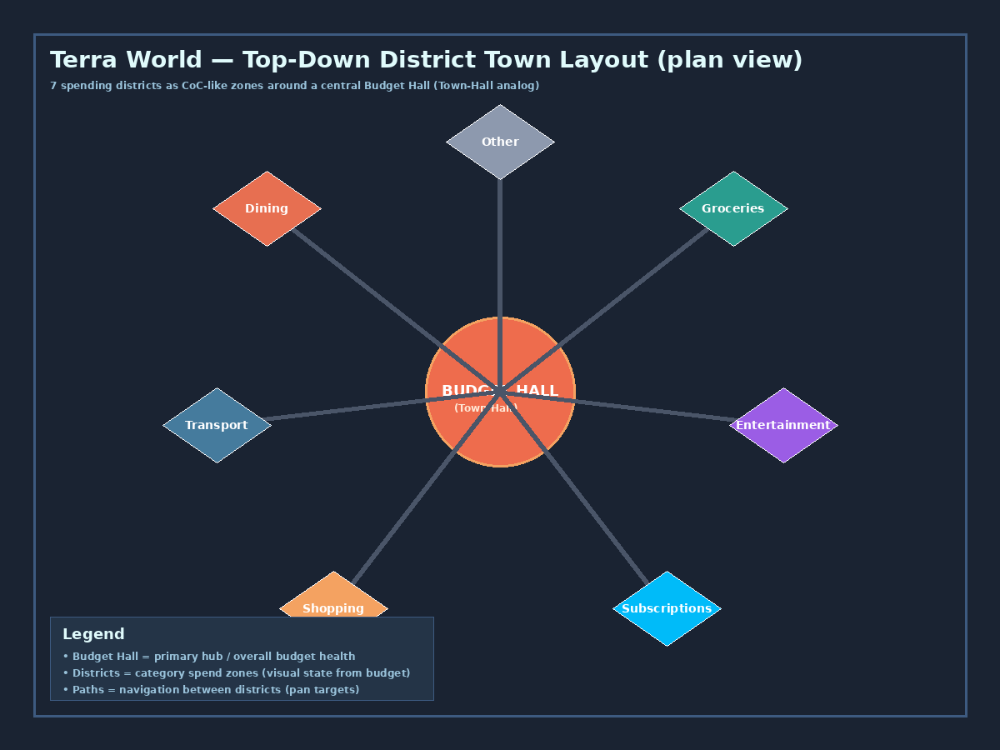
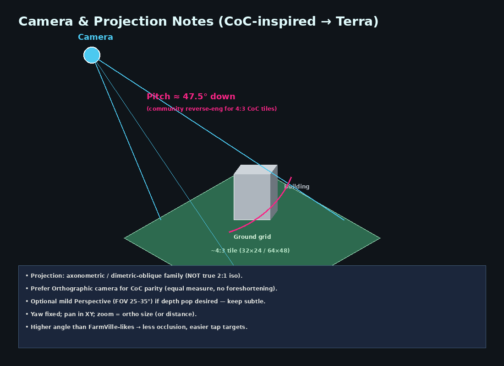
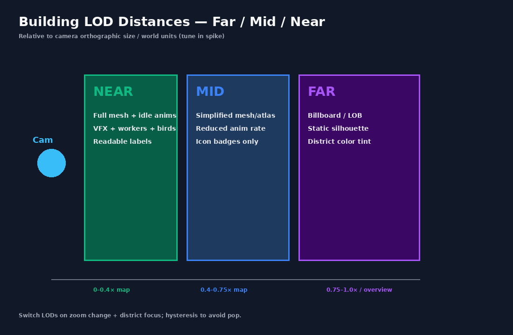
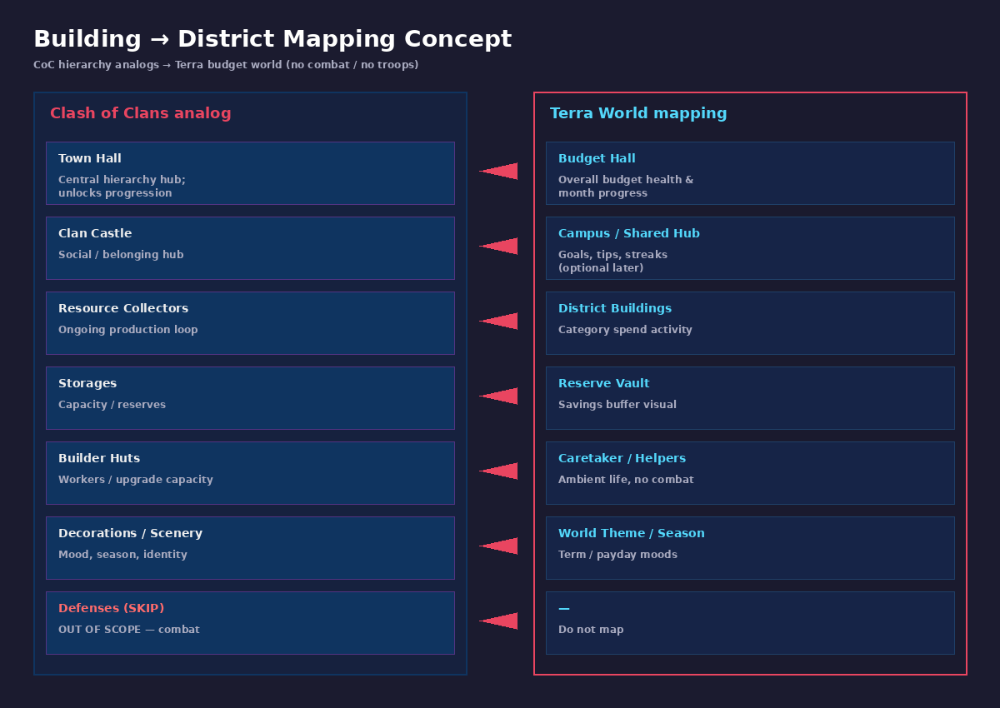

# Terra Unity World — Visual Design Plan (CoC-inspired District Town)

**Product:** Terra (student university budget app)  
**Surface:** Gamified “World” of spending districts  
**Audience:** Manager / Art / Unity engineering  
**Date:** 2026-09-26 (Europe/Berlin)  
**Status:** Research-backed art & product plan — **no combat, no troops attacking**

---

## 1. Goal & scope

### Goal
Ship a **Clash of Clans–like village presentation** for Terra’s World: an inviting, high-angle district town where students **see** budget health as living buildings and zones. Unity later implements presentation, camera, LODs, idle life, and FX — not a strategy combat game.

### In scope
- Orthographic (preferred) or mild-perspective **high-angle** world camera
- **7 districts** as readable zones/buildings: Dining, Groceries, Transport, Entertainment, Shopping, Subscriptions, Other
- Central **Budget Hall** (Town Hall analog)
- Visual states for **budget health** (thrive → ok → wilt)
- Idle ambient life (caretakers, birds, smoke, sparkle) — **non-violent**
- Construction / upgrade / spend / save FX patterns
- LOD plan, art pipeline, naming, palette, acceptance criteria for spikes

### Out of scope
- Combat, troops, raids, walls-as-defense, traps, damage states from attack
- PvP, clan wars, troop donation
- Full day/night simulation as a gameplay system (optional **theme/season skins** only)
- Replicating CoC IP (characters, logos, exact assets) — **inspired by systems**, original Terra art
- Production Unity C# (this doc is design only)

---

## 2. CoC visual system breakdown (what to steal as systems)

Sources: PocketGamer “Making of” (Louhento), GameDeveloper “5 keys”, GameDev SE projection thread, App Store screenshots in `references/`, scenery journalism.

### 2.1 Camera
- **High angle** — intentionally higher than FarmVille-likes so placement/editing (and for Terra: tap targets) stay readable (Supercell: playability over dramatic low camera).
- **Axonometric / dimetric-oblique family**, often called “isometric” colloquially. Community reverse-engineering: **~4:3 ground tiles** (e.g. 32×24 or 64×48 px steps), ortho camera pitched **≈47.5°** down for matching sprite renders.
- Objects stay **equal measure** across the frame (no strong perspective foreshortening) → orthographic camera is the closest Unity match.
- Fixed yaw; player **pans** in the ground plane and **pinches to zoom**.

### 2.2 Lighting & materials
- Bright, readable fantasy-village lighting; soft key + fill; avoid noir/realistic dark.
- Art sweet spot described by Supercell: not “too blubby,” not dark/evil — **Pixar appeal + Capcom polish**.
- Pre-rendered 3D heritage (historical CoC): crisp silhouettes, saturated local colors, clear roof edges. Terra may use **realtime 3D** or **pre-rendered atlases**; either must hit the same readability.

### 2.3 Building LODs (observed / practical)
CoC does not publish LOD tables; from screenshots + mobile practice:
- **Far / overview:** dense village as color masses + iconic silhouettes; scenery backdrop dominates.
- **Mid:** roofs, main volumes, category identity readable; light idle motion.
- **Near / focus:** windows, props, workers, particle FX, labels.

### 2.4 Idle animations & ambient FX
- Builders / villagers walk short loops; flags flutter; smoke from chimneys; waterfalls / birds in scenery.
- Modern **Scenery** packs add themed ambient props, custom music, roaming characters — **cosmetic**, not combat.
- Seasonal Classic Autumn / Winter variants → Terra can map to **term / payday / exam-week themes**.

### 2.5 UI overlays
- Chrome hugs **screen corners** (resources, shop, settings); world stays mostly clear.
- Selection rings / green footprints when placing; info panels as modal sheets — not permanent billboards on every building.
- Terra: show **budget chips** sparingly; prefer **building visual state** as primary signal.

### 2.6 Hierarchy analogs
| CoC | Role | Terra analog |
|-----|------|--------------|
| Town Hall | Center, progression gate | **Budget Hall** |
| Clan Castle | Belonging / social | Optional **Campus Hub** (later) |
| Collectors | Activity | **District buildings** |
| Storages | Capacity | **Reserve Vault** (savings) |
| Builder huts | Workers | **Caretakers** (ambient) |
| Scenery | Mood | **World theme** |
| Defenses | Combat | **Do not map** |

### 2.7 Audio cues (look-adjacent)
Soft bed music + birds / water / construction taps reinforce “alive village.” Terra: light UI ticks on spend/save; avoid war drums / battle stingers.

---

## 3. Terra mapping

### 3.1 District = building / zone
Each of the **7 categories** is a **district plot** with:
1. A **hero building** (primary silhouette)
2. 1–3 **satellite props** (optional at mid+ LOD)
3. A **ground tint** / path color unique to the district
4. A **budget-health material set** (thrive / ok / wilt)

| District | Hero building concept (placeholders) | Accent color |
|----------|--------------------------------------|--------------|
| Dining | Café / dining hall pavilion | Warm coral `#E76F51` |
| Groceries | Market stall / pantry barn | Teal `#2A9D8F` |
| Transport | Bike hub / tram stop | Steel blue `#457B9D` |
| Entertainment | Stage / arcade kiosk | Violet `#9B5DE5` |
| Shopping | Boutique awning / parcel depot | Amber `#F4A261` |
| Subscriptions | Antenna loft / streaming booth | Sky `#00BBF9` |
| Other | Misc shed / catch-all workshop | Slate `#8D99AE` |
| **Budget Hall** | Central cupola / campus hall | Terra coral `#EE6C4D` |

### 3.2 Budget health → visual state
Drive from category remaining budget / overspend ratio (product owns formula):

| State | Visual | Motion |
|-------|--------|--------|
| **Thrive** (≥ healthy threshold) | Saturated greens, flowers, lights on, flags up | Faster idle; birds more frequent |
| **OK** | Canonical materials | Standard idle |
| **Wilt** (overspend / critical) | Desaturated, vines droop, boards, dim windows | Slower idle; dust motes; wilt particles |

Overall Budget Hall reflects **month-level** health; districts reflect **category** health.

### 3.3 Spend / save FX
- **Spend:** brief coin/leaf stream **from** district **toward** Budget Hall (or reverse — pick one and keep consistent); soft dust puff; optional −€ float (UI layer).
- **Save / under-budget win:** sparkle burst, plant growth pulse, vault glow.
- **Category upgrade** (unlocked insight / streak): construction scaffolding → confetti/sparkle (CoC upgrade celebration vibe without combat).

---

## 4. Exact reference photo index

Study files under `references/` (see also `references/REFERENCES.md`).

| Path | Study for |
|------|-----------|
| `references/06_appstore_village_overview_1.jpg` | Overview composition, high camera, tile green, hub dominance |
| `references/07_appstore_village_buildings_2.jpg` | Building silhouettes & roof edge readability |
| `references/08_appstore_village_ui_3.jpg` | HUD vs world separation |
| `references/09_appstore_village_layout_4.jpg` | Pathing / soft borders between clusters |
| `references/10_appstore_clan_social_5.jpg` | Social hub presentation (Campus analog) |
| `references/11_appstore_ipad_village_classic.jpg` | Classic scenery frame (backdrop cliffs/beach) |
| `references/12_appstore_ipad_progression_village.jpg` | Modern materials & mid-zoom density |
| `references/05_appstore_ipad_village_ambient.jpg` | Ambient props / progression marketing depth |
| `references/03_axonometric_projection_comparison.png` | Projection vocabulary for camera debates |
| `references/04_isometric_cube.svg` | Teaching equal-measure axes |
| `references/01_…` / `02_…` GDC JPGs | Historical brand context only |

---

## 5. Wireframes









Editable SVG twins:  
`wireframes/a_district_town_layout.svg`, `wireframes/b_camera_frustum_isometric.svg`, `wireframes/c_lod_distances.svg`, `wireframes/d_building_district_mapping.svg`.

---

## 6. Camera & controls

### 6.1 Recommendation
| Setting | Value | Rationale |
|---------|-------|-----------|
| Projection | **Orthographic** (default) | CoC equal-measure; stable UI alignment |
| Pitch | **45–50°** (target **47.5°** if matching 4:3 sprite pipeline) | Community CoC match; high readability |
| Yaw | Fixed (e.g. 45° or 0° world-aligned) | No free-look; keeps atlas faces consistent |
| FOV | N/A for ortho; if perspective trial: **28–32°** | Mild depth only |
| Pan | One-finger drag / mouse drag on ground plane | Tablet-first (Supercell UX lesson) |
| Zoom | Pinch / scroll → change `orthographicSize` | Clamp to show ≥3 districts … full map |
| Focus | Double-tap district → smooth pan+zoom to Near LOD | Primary navigation |
| Bounds | Soft clamp to island + padding | Prevent empty void |

### 6.2 Zoom targets (suggested)
- **Overview:** all 7 districts + Budget Hall + scenery rim (~1.0× map)
- **Neighborhood:** 2–3 districts (~0.55×)
- **District focus:** one hero building fills ~35–45% height (~0.3×)

### 6.3 Grid / placement
- Logical grid for art snaps (even if player cannot freely place in v1).
- If using 2D/atlas pipeline: **4:3 tile** increments (32×24 or 64×48).
- If realtime 3D: keep footpads on a uniform cell size (e.g. 1×1 or 2×2 m) so LODs and A* caretaker paths stay simple.

---

## 7. Building LOD plan

| LOD | Trigger (relative) | Geometry | Anims | FX / life | UI |
|-----|--------------------|----------|-------|-----------|-----|
| **FAR** | Overview zoom / distant districts | Billboard or ≤300 tris silhouette; district tint | None or 1 shared wind shader | None | District color only |
| **MID** | Neighborhood | Simplified mesh / atlas; clear roof | 0.5× idle rate | Chimney smoke only | Icon badge if wilt |
| **NEAR** | Focused district / Budget Hall | Full mesh or high atlas; props | Full idle loops | Workers, birds, sparkles | Optional name + € chip |

**Rules**
- Hysteresis (±5% zoom) to prevent pop.
- Never show wilt props at FAR — tint only.
- Budget Hall always one LOD higher than average districts when visible.

---

## 8. Character / ambient life patterns (no combat)

| Agent | Behavior | Notes |
|-------|----------|-------|
| Caretaker | Walks path Budget Hall ↔ random thriving district; pauses to “hammer” briefly | Upgrade/construction vibe; never attacks |
| Student silhouette | Crosses paths at low opacity | Optional; keep non-identifiable |
| Birds | Arc flybys over thriving zones | Suppress over wilt zones |
| Flags / cloth | Shader wind | District accent color |
| Smoke / steam | Looping particle on Dining / Groceries | Cozy, not fire-hazard |

**Hard ban:** weapons, troops deploying, explosions as damage, red “under attack” alerts.

---

## 9. FX patterns

| Event | Look | Duration | Audio (optional) |
|-------|------|----------|------------------|
| Construction / first unlock | Dust puff + scaffolding dissolve | 1.5–2.5s | Soft wood taps |
| Upgrade / streak | Gold/teal sparkle ring | 1.0–1.5s | Chime |
| Spend | Token stream district → Hall | 0.8–1.2s | Soft coin |
| Save / under budget | Plant growth + vault glow | 1.2s | Warm swell |
| Wilt onset | Leaves fall, desat lerp | 2.0s | Dry rustle |
| Thrive restore | Color saturate + flower bloom | 2.0s | Birds+ |

Keep FX **readable on mid-range phones**; cap simultaneous particle systems (e.g. ≤3 districts FX at once).

---

## 10. Art pipeline

### 10.1 Target platforms
Phone-first (Android/iOS) + tablet. Design for **60 fps mid** devices; LOD is the budget lever.

### 10.2 Asset sizes (starting points)
| Asset | Texture | Mesh budget (NEAR) |
|-------|---------|---------------------|
| Hero building | 512–1024 atlas page | 1.5k–4k tris or equivalent atlas |
| Satellite prop | 256–512 | ≤800 tris |
| Budget Hall | 1024 | 3k–6k tris |
| Ground tile/decal | 256 tiled | — |
| Character caretaker | 256–512 | ≤1.5k tris or 2D spine/frames |
| Scenery backdrop | 2048 strip or skybox | Low poly rim |

### 10.3 Atlas & naming
```
terra_world/
  buildings/{district}/hero_near|mid|far
  buildings/budget_hall/...
  props/{district}/...
  characters/caretaker/...
  fx/{event}/...
  ui/world/...
  themes/{classic|term|payday}/...
```
Unity import: Generate Mip Maps on; compression ASTC/ETC2; sRGB for albedo; no mip for UI.

### 10.4 Color palette (World)
| Role | Hex |
|------|-----|
| Grass A/B | `#3A7D44` / `#2D6A4F` |
| Path | `#C2B280` |
| Water | `#4EA8DE` |
| Thrive accent | `#52B788` |
| Wilt accent | `#6C757D` + `#A4161A` trim |
| UI chrome | `#1B263B` / `#E0E1DD` |
| District accents | see §3.1 |

### 10.5 Style pillars
1. **Readable at fingernail size** (App Store thumb).  
2. **Friendly campus fantasy** — Pixar-clear, Capcom-polished; not dark / not infant.  
3. **Budget truth in materials** — wilt/thrive must be obvious without reading numbers.  
4. **Original IP** — CoC-inspired systems only.

---

## 11. Acceptance criteria — Unity spike slices

Small, testable slices for engineering (no combat):

Spike A (camera) and Spike B (layout) are implemented in `unity/`. Open that folder in Unity 6.3 LTS and press Play — steps are in the repo README under **Unity World**. Spikes C–F are not in that scene.

### Spike A — Camera shell
- [ ] Ortho camera pitch 47.5° ±2°, fixed yaw  
- [ ] Pan + pinch zoom with clamps  
- [ ] Double-tap focuses dummy cube “district”  
- [ ] 60 fps on mid device with empty scene + 8 cubes  

### Spike B — District layout
- [ ] Place 7 colored plots + Budget Hall per wireframe A  
- [ ] Paths as simple line renderers or decals  
- [ ] Tap district → logs category id  

### Spike C — LOD swap
- [ ] Three meshes/sprites per building; swap on zoom bands (§7)  
- [ ] Hysteresis prevents flicker when scrubbing zoom  

### Spike D — Budget visual states
- [ ] Mock API drives thrive/ok/wilt materials on 2 districts  
- [ ] State change lerps ≤2s with wilt/thrive FX stubs  

### Spike E — Ambient life
- [ ] One caretaker NavMesh/path loop  
- [ ] Bird flyby prefab; disabled over wilt  

### Spike F — Spend/save FX
- [ ] Trigger spend stream and save sparkle from debug buttons  
- [ ] Particle budget documented  

**Exit for “World v0 playable”:** A+B+C+D green; E/F nice-to-have same sprint.

---

## 12. Open questions for Ali / Manager

1. **Realtime 3D vs pre-rendered atlases** for v1? (Atlases ship faster; 3D eases LOD/lighting.)  
2. Can students **rearrange** districts, or is layout **authored fixed**?  
3. Is **Campus Hub** (clan-castle analog) in v1 or later?  
4. Exact **thrive/ok/wilt thresholds** (remaining %, absolute €, or streak-based)?  
5. **Season themes** tied to university calendar (exam week wilt global?) — yes/no?  
6. Brand: how close to CoC silhouette language vs distinct Terra illustration?  
7. Accessibility: colorblind-safe wilt/thrive (need pattern, not only hue)?  
8. Localization: building labels on NEAR LOD — language expansion plan?  
9. Offline: World still shows last-known states?  
10. Performance floor device list for spike acceptance?

---

## 13. Deliverables checklist (this package)

| Item | Path |
|------|------|
| This plan | `docs/unity-world/TERRA_UNITY_WORLD_VISUAL_PLAN.md` |
| Reference images | `docs/unity-world/references/*.jpg|png|svg` (12 files) |
| Reference index | `docs/unity-world/references/REFERENCES.md` |
| Wireframes PNG+SVG | `docs/unity-world/wireframes/a_*` … `d_*` |

---

## 14. Summary for Unity kickoff

Build a **calm, high-angle orthographic district town**. Map CoC’s Town Hall → **Budget Hall**, buildings → **spend districts**, scenery → **themes**, builders → **caretakers**. Encode budget as **thrive/wilt**, not HP. Steal CoC’s camera height, equal-measure readability, corner HUD, and idle life — leave combat systems on the cutting-room floor.
